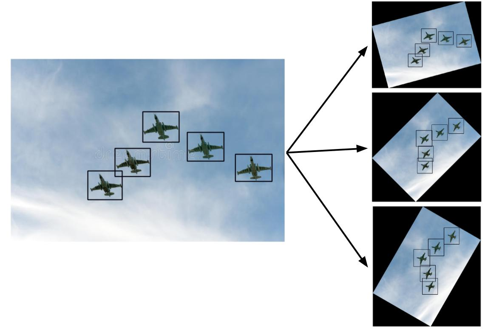

# How to Rotate YOLO Bounding Boxes in 2D?



A simple python implementation to rotate images and the associated bounding boxes obtained 
via Yolo_mark. See here for a more detailed explanation.

To do a test run, try

```python
python rotate.py -i group-airplanes.jpg -a 25
```

For more detail, see [here](https://usmanr149.github.io/urmlblog/yolo/2020/03/05/rotate_yolo_bbox.html).
